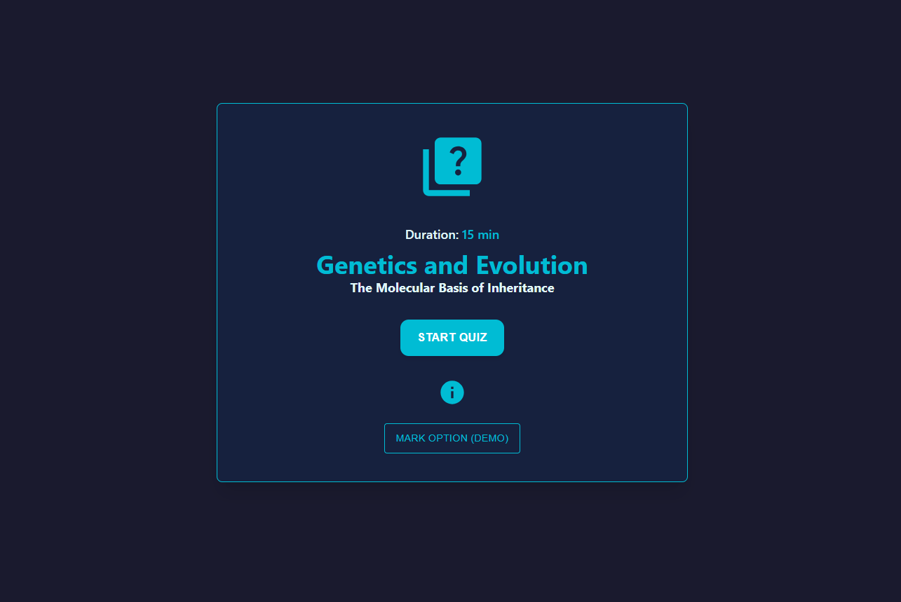
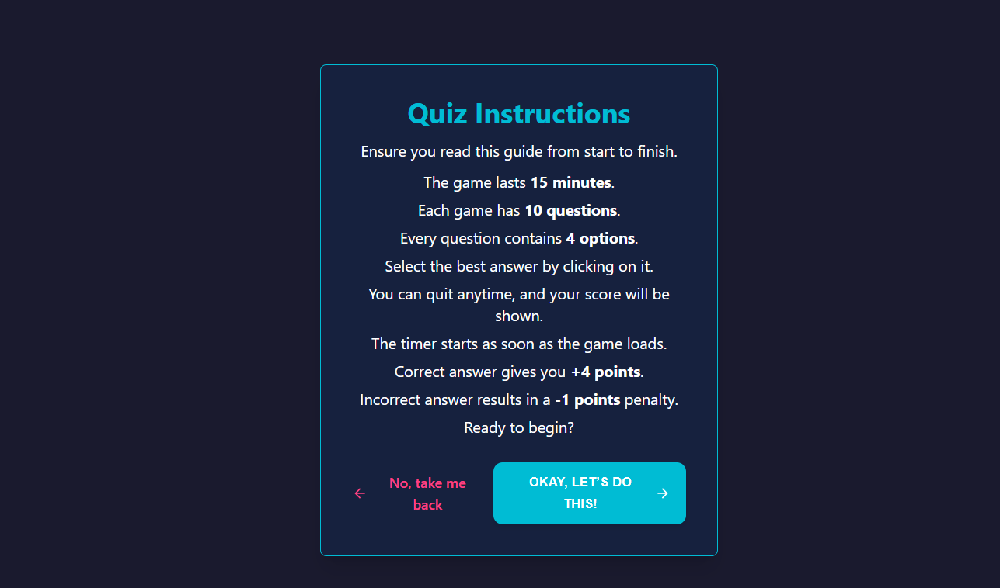
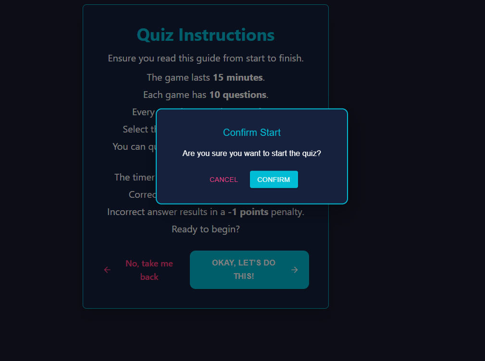
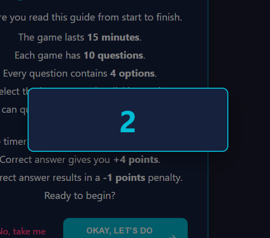
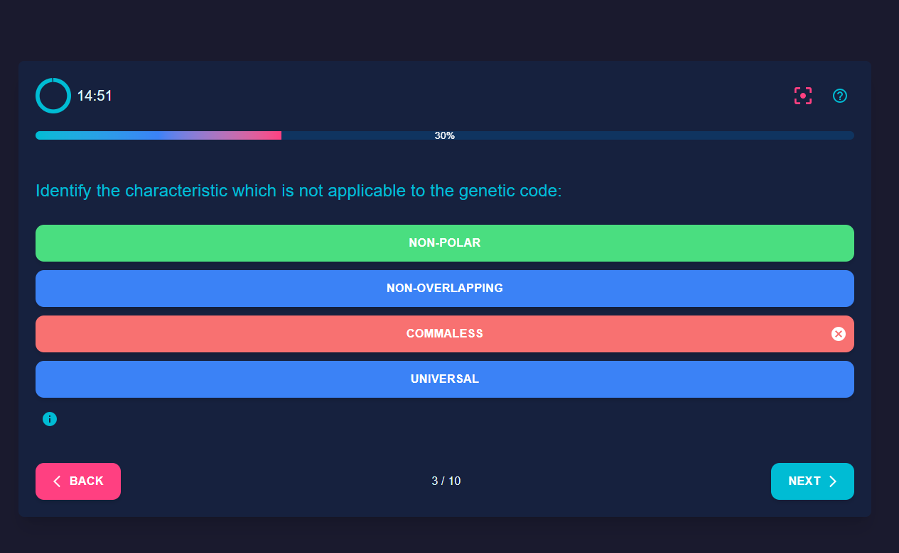
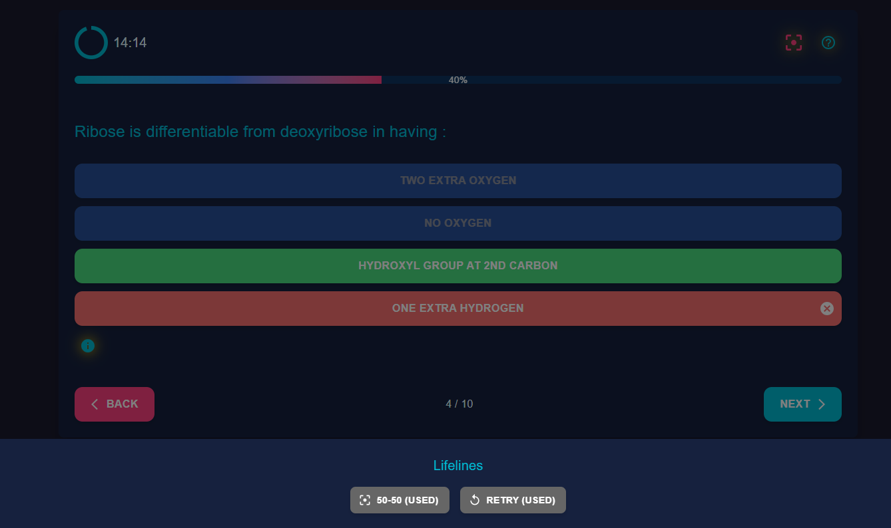

no image displaying # React + Vite

# Quiz Game App

## Project Overview

This is a gamified quiz app built with React. It allows users to play quizzes with a countdown timer, hints, lifelines, and a scoring system. The data is fetched from an external API, and the app features dynamic animations and a responsive UI.

## Features

- Multiple-choice quiz questions
- Countdown timer
- Scoring system with positive and negative marks
- Hints and Lifelines for difficult questions

Technologies Used
React
Axios for API requests
Tailwind CSS for styling
Vite for bundling

1. **Screenshots**
   Here are some screenshots of the project in action:








## Installation

1. Clone the repository:
   ```bash
   git clone https://https://github.com/Divyanshu-Mishra9620/Quiz-Game.git
   ```
2. Install dependencies:
   ```bash
   npm install
   ```
3. Run the project:
   ```bash
   npm run dev
   ```
